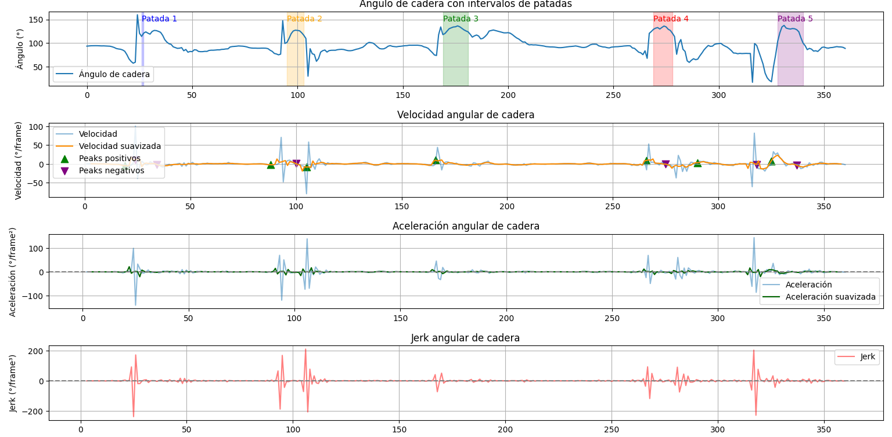

# 🥋 Análisis de Patada de Costado con MediaPipe y OpenCV

**Autor:** José Chamorro  
**Profesión:** Kinesiólogo · Quiropráctico · Especialista en Biomecánica y entusiasta en Data Science.  
**Repositorio:** [github.com/joch89](https://github.com/joch89)

---

## 🎯 Descripción del proyecto

Este proyecto utiliza **MediaPipe**, **OpenCV** y **Python** para detectar, registrar y analizar el movimiento de una **patada de costado (yoko geri)** en taekwondo.

💡 **Nota:** El modelo de landmarks de MediaPipe funciona mediante **redes neuronales convolucionales (CNN)** para la detección de puntos clave del cuerpo. Más información en la [página oficial de MediaPipe](https://ai.google.dev/edge/mediapipe/solutions/vision/pose_landmarker?hl=es-419).

El objetivo es desarrollar una herramienta que permita analizar el rendimiento biomecánico del movimiento, proporcionando métricas como:

- Ángulo de cadera y rodilla  
- Velocidad, aceleración y jerk angular  
- Detección automática de inicio y fin de patadas  
- Contador de patadas y visualización en video  


Video de Patadas procesadas


Imagen de Gráficos resultantes


## 🧩 Estructura del proyecto

- `kick_analyzer/` - Carpeta principal del proyecto  
  - `core/` - Funciones y utilidades centrales  
    - `pose_utils.py` - Funciones para procesar poses y calcular métricas  
  - `videos/` - Carpeta para videos de entrada 
  - `export_video.py` - Script para procesar video y exportar resultados visuales  
  - `save_csv.py` - Script para guardar datos de landmarks en CSV  
  - `kick_analysis.py` - Script para análisis y visualización de datos
  - `pose_landmarker_heavy.task` - Modelo de ML de Mediapipe 


## ⚙️ Flujo de trabajo

### 0️⃣ Preparar modelo de MediaPipe
Este proyecto utiliza el modelo **pose_landmarker_heavy** de MediaPipe para detectar los landmarks del cuerpo.  
Puedes descargarlo directamente desde:

[Modelo pose_landmarker_heavy (float16)](https://storage.googleapis.com/mediapipe-models/pose_landmarker/pose_landmarker_heavy/float16/latest/pose_landmarker_heavy.task)

Guarda el archivo descargado en la **carpeta raíz del proyecto**, por ejemplo:

kick_analyzer/pose_landmarker_heavy.task

### 1️⃣ Extraer datos del video
Guarda los landmarks detectados en un CSV.

```bash
python save_csv.py
```

### 2️⃣ Analizar biomecánicamente la patada
Genera gráficos de ángulo, velocidad, aceleración y jerk angular.

```bash
python kick_analysis.py
```

### 3️⃣ Exportar video con resultados

Dibuja los landmarks, contador y ángulos sobre el video original.
```bash
python export_video.py
```

🎥 Salida: outputs/output_video.mp4


## 📦 Dependencias principales

Instala los requisitos con:
```bash
pip install opencv-python mediapipe pandas matplotlib scipy numpy
```


## 🧠 Futuras mejoras
- Comparador automático entre deportistas o sesiones.
- Integración con métricas de flexibilidad y estabilidad postural.


## 🩺 Aplicación en ciencias del movimiento

Este sistema combina análisis biomecánico con herramientas de **Data Science** aplicadas a la salud y el rendimiento deportivo, facilitando la **cuantificación objetiva del movimiento**.

💡 **Puntos clave:**

- Permite la **detección automática de movimientos** y **reconocimiento de patrones específicos**, como la patada de costado (yoko geri).

- Genera un **archivo CSV con todos los landmarks y métricas** (ángulos, velocidad, aceleración y jerk) para un análisis numérico **flexible y extensible**: puedes procesar los datos con Python, Excel o cualquier software estadístico.

- Facilita **comparaciones entre sesiones, deportistas o técnicas**, gracias a la riqueza de los datos numéricos obtenidos automáticamente.

- Integra **visualización en video con métricas superpuestas**, combinando lo cuantitativo y lo visual para un feedback inmediato y práctico.

---

## 🚀 Conclusión

Este proyecto demuestra cómo la combinación de **visión por computadora**, **Machine Learning** y **análisis biomecánico** permite llevar el estudio del movimiento deportivo a un nivel cuantitativo y objetivo.  

Gracias a la generación automática de métricas y la visualización en video, se facilita el **feedback inmediato** para deportistas y entrenadores, así como la posibilidad de realizar estudios comparativos y mejorar la técnica.  

💡 **Siguientes pasos posibles:**
- Integración con más tipos de movimientos y técnicas de artes marciales.
- Desarrollo de dashboards interactivos para análisis en tiempo real.
- Uso de modelos más avanzados o personalizados.
- Incorporación de análisis de fuerza y estabilidad mediante sensores externos o cámaras adicionales.

Este repositorio sirve como **base extensible** para proyectos de análisis de movimiento, biomecánica aplicada y ciencia de datos en salud deportiva.


